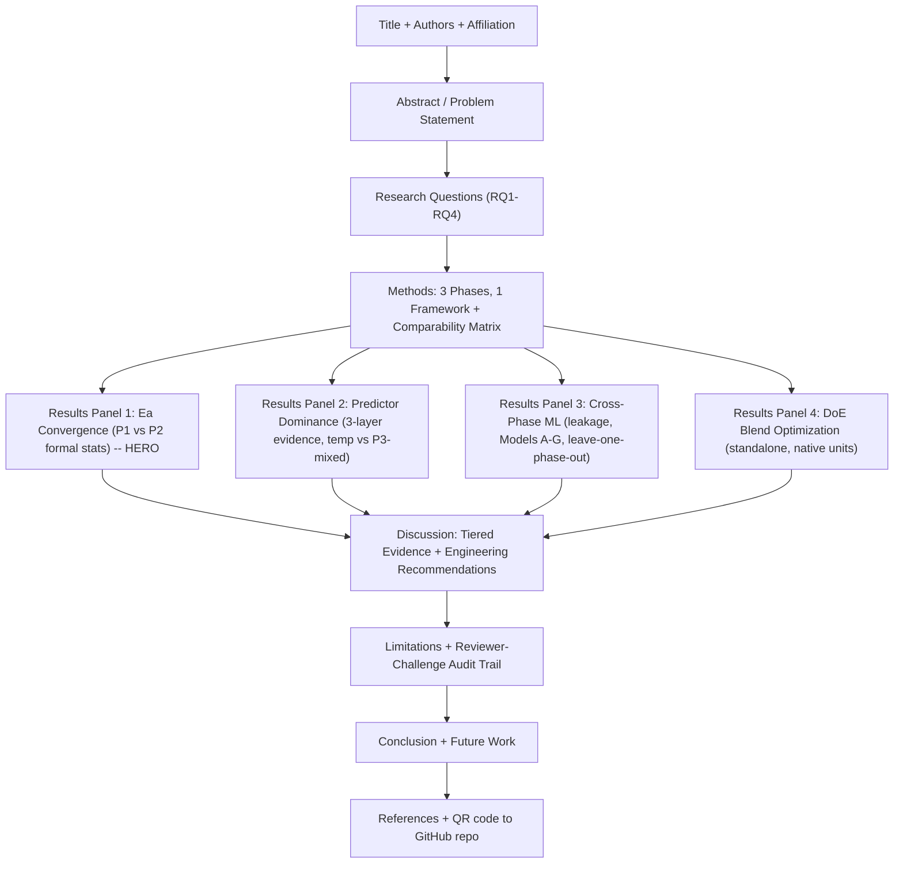

# A Comparative Machine Learning Framework for Predicting Corrosion Behavior of Green Inhibitors Across Variable Environmental Conditions

*Working synthesis document — draft research plan for poster development, tying together the three existing sub-projects in this repository into one coherent, presentable study.*

---

## 1. Background

Mild steel corrosion in aggressive acidic/basic environments (HCl, NaOH) is a major cause of material failure and economic loss in oil & gas, chemical processing, pickling, and water treatment industries. Synthetic inhibitors (chromates, phosphates) are effective but toxic and environmentally restricted. **Green, plant-derived inhibitors** — bitter leaf, plantain peel, snail water, and Okro (okra) leaf extract — offer a sustainable alternative, but their performance is highly sensitive to environmental variables: **temperature, exposure time, acid/base strength, and inhibitor dosage**.

This repository holds **one continuous in-house research program**, run in our own lab, broken into three experimental phases as the work progressed — not three separate external studies:

| # | Phase | Inhibitor System | Environmental Variable Isolated | Technique |
|---|---------|------------------|----------------------------------|-----------|
| 1 | Ternary Blend Under Variable Temperature/Time | BL + PP + SW blend (3-component), formulated in-house | Temperature (40–80°C) *and* Time (25–125h), separately + DoE blend optimization | Weight loss |
| 2 | Green Inhibitor in Multi-pH/Multi-Temperature Environment | Single green inhibitor, our earlier screening candidate | Temperature (30–70°C) *and* Time (3–15h), at multiple acid molarities | Weight loss |
| 3 | Okro Leaf Extract in Acidic vs Basic Media | Okro (okra) leaf extract, tested for a broader medium (acid/base) generality check | Medium type: Acidic (HCl) vs Basic (NaOH), plus temperature | Tafel polarization (electrochemical) |

Because all three phases were generated within the same in-house research program and share a common corrosion-rate target, their data can be harmonized into a unified analytical framework while explicitly preserving differences in inhibitor chemistry, measurement technique, medium, and experimental range. Same-lab does not mean statistically/comparably interchangeable — Section 5.3 below builds an actual merged master dataset directly from the raw weight-loss and Tafel files, computes cross-phase statistics using one consistent method, and Section 5.4 documents the formal statistical tests, leakage-resistant validation, and cross-phase generalization experiments that keep this comparison defensible. A full question-by-question audit of the methodological risks in this approach is maintained in [`REVIEWER_CHALLENGES.md`](REVIEWER_CHALLENGES.md).

---

## 2. Problem Statement

> Industrial systems exposed to acidic or basic media suffer accelerated corrosion under fluctuating temperature and variable exposure duration. While green inhibitors are promising eco-friendly alternatives to toxic synthetic inhibitors, their protective performance degrades unpredictably with rising temperature, prolonged exposure, and shifting solution chemistry (acidic vs basic, concentration). Existing corrosion studies typically examine **one inhibitor under one condition using one measurement technique**, making it difficult to know whether machine learning-based prediction is *generally* reliable for green inhibitors, or only reliable in narrow, favorable conditions. There is a need for a systematic, cross-condition, cross-technique comparison to establish **which environmental variable most threatens inhibitor performance**, and **which ML modeling strategy is most robust** for predicting corrosion rate (CR) and inhibition efficiency (IE) across these varying real-world scenarios.

---

## 3. Research Questions

Four separable questions, deliberately not compressed into one compound question:

**RQ1 — Scientific convergence:** Do independently tested green inhibitor systems exhibit consistent temperature-dependent corrosion behaviour? *(Primary evidence: Arrhenius activation-energy analysis for P1 and P2 only — see Section 5.4.)*

**RQ2 — Environmental drivers:** How does the dominant predictor of corrosion rate change with temperature, exposure time, inhibitor concentration, and solution chemistry across the experimental phases? Do the observed temperature–performance relationships show consistent degradation patterns across inhibitor systems? *(Evidence: correlation + permutation importance + feature ablation, three layers required to agree before a factor is called dominant — see Section 5.4. Temperature dominance is NOT claimed universally; it is conditional on phase, per the evidence.)*

**RQ3 — Cross-phase generalization:** Can a model trained across some experimental phases generalize to a phase it has not seen? *(Evidence: Models A–G, grouped/leakage-resistant cross-validation, and leave-one-phase-out testing — see Section 5.4.)*

**RQ4 — Measurement robustness:** How does changing the measurement regime from gravimetric weight loss to Tafel electrochemical measurement affect predictive reliability? *(Evidence: P1/P2 vs P3 model performance contrast — see Section 5.4. Poor P3 ML performance is not interpreted as evidence that Okro extract is a weaker inhibitor.)*

**Standalone finding (not a comparative RQ):** What does the P1 DoE reveal about optimal ternary-blend conditions, and can its performance be interpreted relative to other phases without making invalid cross-unit dosage comparisons? DoE doses are recorded in mL of blend, not ppm, and are never converted or merged with the ppm-based studies (see Section 5.1/5.3 caveats and [`REVIEWER_CHALLENGES.md`](REVIEWER_CHALLENGES.md) Q16). The DoE optimization result therefore stands on its own, not as a comparative blend-vs-single-inhibitor claim.

---

## 4. Novelty / Contribution of the Combined Study

Individually, each sub-project is a solid applied ML case study. Combined, they enable claims none of them can make alone:

- **A cross-technique reliability check**: showing that gravimetric (weight-loss) datasets yield much higher-confidence ML models than electrochemical (Tafel) datasets at similar sample sizes — an actionable methodological insight for future experiment design (collect more Tafel replicates, or prefer weight-loss for ML-ready data). Section 5.4 quantifies this further, including how much of that gap is inflated by naive (non-grouped) cross-validation.
- **A rigor check on the "temperature dominance" hypothesis**: temperature consistently dominates the temperature-varying **gravimetric** phases (P1 and P2, confirmed via correlation + permutation importance + ablation all agreeing), while its predictive role becomes conditional or inconclusive under the smaller Tafel datasets (P3, where the three evidence layers disagree). This is a more precise and defensible claim than asserting temperature is universally dominant across all three phases — the study's own data does not support that stronger claim (see Section 5.4).
- **A standalone DoE optimization result**: Project 1's ternary blend DoE identifies an optimal blend point (~1.64 mm/yr CR, ~87.6% IE), reported on its own terms in its native mL-blend units — not benchmarked against Project 2's or Project 3's ppm-dosed results, since no validated mL-to-ppm conversion exists.
- **A practical decision framework** for engineers: "if you know your operating temperature, time window, and medium (acid/base), which model + dosing table should you consult?"

---

## 5. Unified Methodology (Comparative Framework)

### 5.1 Data Harmonization Table

| Variable | Project 1 (Blend) | Project 2 (Multi-pH) | Project 3 (Okro) |
|---|---|---|---|
| Inhibitor | BL+PP+SW blend | Unnamed green inhibitor | Okro leaf extract |
| Technique | Weight loss | Weight loss | Tafel polarization (+OCP/LSV) |
| Temp range | 40–80°C | 30–70°C | 30–60°C |
| Time range | 25–125h | 3–15h | fixed/short |
| Medium | 1M HCl (implied) | HCl, 0.5–1.5M | HCl **and** NaOH, 1.0–2.5M |
| Dosage range | 0–250 ppm | 0–450 ppm | 50–200 ppm |
| Sample size | 30 per sub-study | 75–78 per sub-study | 17 per medium |
| Best CR model | MLP (temp) / Ridge (time) | CatBoost | XGBoost (acidic) / MLP (basic) |
| Best CR R² | 0.967 / 0.9995 | 0.808 | 0.338 (CV) |

### 5.2 Required Robustness Analyses (implemented — see Section 5.4 and `Unified_Analysis/`)

An earlier draft of this section proposed a lightweight set of analyses (normalized overlay plot, feature-importance table, leaderboard, ANOVA, cost/dosage-efficiency chart). The dosage-efficiency-across-all-three-systems chart in particular was **structurally invalid** — it would have mixed P1-DoE's mL-blend doses with the ppm-dosed studies with no validated conversion factor, and has been permanently dropped rather than left as a future item (see [`REVIEWER_CHALLENGES.md`](REVIEWER_CHALLENGES.md) Q16).

That list has been replaced by the following, all now implemented in `Unified_Analysis/`:

- Data-quality audit (missingness, duplicates, non-positive CR flagged not deleted) — `data_quality_audit.py`
- Explicit comparability matrix (what's shared vs different across P1/P2/P3) — `data_quality_audit.py`
- Formal Ea comparison (P1 vs P2 only) with statistical test + dose-group sensitivity — `ea_analysis.py`
- 3-layer predictor-dominance evidence (correlation + permutation importance + ablation) + interaction check — `predictor_ablation.py`
- Leakage-resistant validation: standard CV + grouped CV + leave-one-phase-out — `cross_phase_model_experiments.py`
- Models A–G (including phase-identity ablation F/G) across 4 model families (Ridge/RandomForest/XGBoost/CatBoost) — `cross_phase_model_experiments.py`
- P1+P2 vs P1+P2+P3 comparison, reported neutrally — `cross_phase_model_experiments.py`
- Strict mL/ppm dosage separation enforced in the data schema itself, not just prose — `build_master_dataset.py`

Results from all of the above are summarized in Section 5.4, and the full reviewer-question-by-question mapping is in [`REVIEWER_CHALLENGES.md`](REVIEWER_CHALLENGES.md).

### 5.3 Verified Merge Results (Computed Directly From Raw Lab Data)

A merge script (`Unified_Analysis/build_master_dataset.py`) now pools all 7 experimental sub-phases (P1-Temperature, P1-Time, P1-DoE-Blend, P2-Temperature, P2-Time, P3-Okro-Acid, P3-Okro-Basic) into one 302-row master dataset (`Unified_Analysis/master_corrosion_dataset.csv`) with a common schema: `Study, Phase_Group, Inhibitor_System, Technique, Medium_Type, Molarity_M, Dose_Value, Dose_Unit, Concentration_ppm, Temp_C, Time_h, CR_mm_yr, IE_percent`. `Dose_Value`/`Dose_Unit` (`'ppm'` or `'mL_blend'`) structurally separate P1-DoE's mL doses from the ppm-dosed studies — `Concentration_ppm` is only populated where `Dose_Unit=='ppm'`. The same statistical method is then applied identically across every phase — this is the first time all three phases have been measured on one consistent yardstick.

**Correlation of CR with Temperature / Time / Concentration (recomputed fresh from raw data, not copied from old write-ups):**

| Study | n | r(CR, Temp) | r(CR, Time) | r(CR, Concentration) |
|---|---|---|---|---|
| P1-Temperature | 30 | **0.907** | — | -0.241 |
| P2-Temperature | 90 | **0.770** | — | -0.170 |
| P3-Okro-Acid | 17 | 0.336 | — | -0.350 |
| P3-Okro-Basic | 17 | -0.377 | — | 0.050 |
| P1-Time | 30 | — | -0.014 | **-0.696** |
| P2-Time | 90 | — | -0.223 | **-0.587** |
| P1-DoE-Blend | 28 | — | 0.598 | — |

**Arrhenius activation energy (Ea), fit per dose group as ln(CR) vs 1/T, averaged per phase:**

| Study | Dose groups fit | Ea (kJ/mol) |
|---|---|---|
| P1-Temperature (ternary blend) | 6 | **61.1 ± 9.6** |
| P2-Temperature (single inhibitor) | 6 | **66.5 ± 15.1** |
| P3-Okro-Acid | 4 | 11.2 ± 9.7 (low confidence) |
| P3-Okro-Basic | 3 | -180 ± 513 (unreliable — noisy/near-zero Tafel currents) |

**Dosage efficiency index (mean IE% ÷ mean ppm tested — ranked):**

| Study | n | Mean IE% | Mean ppm | IE%/ppm |
|---|---|---|---|---|
| P1-DoE-Blend* | 28 | 81.7 | 15.0 mL | 5.44 (different units — see caveat) |
| P1-Time | 25 | 81.2 | 150 | 0.729 |
| P1-Temperature | 25 | 43.8 | 150 | 0.339 |
| P2-Time | 75 | 60.6 | 250 | 0.323 |
| P2-Temperature | 75 | 44.1 | 250 | 0.241 |

*\*P1-DoE-Blend doses in mL of blend, not ppm — not directly comparable to the ppm-based rows; kept separate to avoid a misleading ranking.*

**What this actually tells us (new, only visible after pooling):**

1. **Activation energy converges around 60–67 kJ/mol for both independent weight-loss phases (P1-Temperature and P2-Temperature)**, despite using two different green inhibitor systems (ternary blend vs single inhibitor). The convergence of the apparent activation energies is consistent with an inhibition mechanism dominated by surface coverage/adsorption rather than a substantial alteration of the apparent corrosion reaction barrier — no adsorption isotherm was measured in either phase, so no stronger mechanistic claim is made. Section 5.4 reports the formal statistical comparison (not just "the numbers are close") and a dose-group sensitivity check.
2. **The Okro Tafel data cannot support a reliable Ea estimate** (11 kJ/mol in acid is suspiciously low; basic media is numerically unstable due to near-zero/sign-flipping corrosion currents at some conditions). This directly confirms Finding 4 below with hard numbers, not just a technique-vs-technique impression — it flags exactly where more replicate electrochemical measurements are needed before that phase can support Arrhenius-level claims.
3. **Concentration dominates over temperature in both time-based phases** (r = -0.696 and -0.587), while **temperature dominates over concentration in both temperature-based phases** (r = 0.907/0.770 vs -0.241/-0.170) — this is a genuinely pooled, apples-to-apples confirmation (using identical correlation methodology) that the controlling variable in each experiment design is doing the expected work, and that dosage becomes the second-order lever once temperature is fixed.
4. **Dosage efficiency is consistently higher in the time-based phases than the temperature-based phases for the same inhibitor family** (P1-Time 0.729 vs P1-Temperature 0.339; P2-Time 0.323 vs P2-Temperature 0.241) — i.e., a given ppm of inhibitor buys more inhibition efficiency at moderate/room temperature than it does at elevated temperature. This is a clean, quantified way to state "heat degrades inhibitor economics," useful for the poster's cost/dosage panel.

### 5.4 Rigor-Hardened Results (Formal Statistics + Cross-Phase ML)

Everything below is computed from the raw data via `Unified_Analysis/ea_analysis.py`, `predictor_ablation.py`, and `cross_phase_model_experiments.py`, and is mapped question-by-question to reviewer concerns in [`REVIEWER_CHALLENGES.md`](REVIEWER_CHALLENGES.md).

**Formal Ea comparison (P1 vs P2 only — headline finding):**

| | P1-Temperature | P2-Temperature |
|---|---|---|
| Ea (mean ± SD, kJ/mol) | 61.1 ± 10.6 | 66.5 ± 16.6 |
| n dose groups | 6 | 6 |
| Difference | 5.4 kJ/mol (SE = 8.0) | |
| Welch's t-test | t = -0.67, **p = 0.52** | |
| Mann-Whitney U | **p = 0.70** | |
| Cohen's d | -0.39 (small-moderate) | |
| Dose-group jackknife range | 59.1–64.8 kJ/mol | 61.7–70.7 kJ/mol |

**Conclusion**: the two estimates are *not statistically distinguishable within the uncertainty of the fitted estimates* — a formal test, not "the confidence intervals overlap." The convergence is stable under leave-one-dose-group-out sensitivity (no single dose group drives it). P3's Ea (11.2 ± 9.7 kJ/mol acid; -180 ± 513 kJ/mol basic) is excluded from this comparison entirely — its own per-dose-group fits are too inconsistent to trust (individual basic-media fits ranged from -897 to +280 kJ/mol), not because it disagrees with P1/P2.

**3-layer predictor-dominance evidence** (correlation + permutation importance + ablation must all agree before a factor is called "dominant"):

| Phase | Layer 1 (correlation) | Layer 2 (permutation importance) | Layer 3 (ablation R² drop) | Agreement |
|---|---|---|---|---|
| P1-Temperature | Temp_C | Temp_C | Temp_C | **AGREE — temperature dominant** |
| P2-Temperature | Temp_C | Temp_C | Temp_C | **AGREE — temperature dominant** |
| P3-Okro-Acid | Dose_Value | Temp_C | Dose_Value | MIXED — no dominant factor claimed |
| P3-Okro-Basic | Temp_C | Temp_C | Molarity_M | MIXED — no dominant factor claimed |

An interaction check (`Dose_Value × Temp_C` OLS term) found no significant interaction in either gravimetric temperature phase (P1: p=0.62; P2: p=0.55) — concentration does not measurably modify the temperature effect in these phases.

**Leakage-resistant validation — a materially important finding**: standard random 5-fold CV substantially overestimates performance vs. grouped CV (grouped by rounded Study+Dose+Temp+Time condition, preventing near-duplicate conditions from splitting across train/test):

| Config | Model | Standard CV R² | Grouped CV R² |
|---|---|---|---|
| P1 only | XGBoost | 0.983 | 0.372 |
| P2 only | RandomForest | 0.965 | -0.236 |
| P1+P2 | CatBoost | 0.971 | 0.421 |
| P1+P2+P3 | CatBoost | 0.608 | 0.041 |

This means historical R² figures from the original per-project notebooks (e.g. R²=0.9995) likely reflect the same optimistic-CV effect and should be read with this caveat — grouped CV is the more defensible number for any generalization claim.

**Models A–G (phase-identity ablation) and P1+P2 vs P1+P2+P3**: removing `Technique`/`Medium_Type`/`Inhibitor_System` from the P1+P2 model changes R² by <0.01 in nearly every model/CV combination (identity features carry ~1.2% of permutation importance) — the model is learning from real environmental variables, not phase identity, when phases share the same technique. Once P3 (a different technique) is added, identity features become more informative (~6.0% of permutation importance) and removing them causes larger swings — most plausibly because they help the model recognize the very different Tafel measurement scale, not because of a shortcut. Adding P3 to P1+P2 **hurts** pooled performance in 6 of 8 model×CV-scheme comparisons (e.g. XGBoost standard CV: 0.964→0.364), consistent with P3 representing a genuine distribution/measurement-regime shift.

**Leave-one-phase-out generalization** (train on two phases, test entirely on the third, never seen in training):

| Train → Test | Best model | R² | MAE |
|---|---|---|---|
| P1+P2 → P3 | CatBoost | -0.24 | 83.7 |
| P1+P3 → P2 | XGBoost | 0.40 | 40.0 |
| P2+P3 → P1 | Ridge | 0.57 | 34.2 |

Transfer is direction-dependent: gravimetric-trained models cannot predict Tafel data at all (negative R² across all 4 models), while models trained with some Tafel data included transfer moderately well to gravimetric phases. Every direction involves an inhibitor system unseen during training — cross-phase generalization here is **not** equivalent to a controlled test of unseen-inhibitor-chemistry generalization (the two are confounded in this design; see [`REVIEWER_CHALLENGES.md`](REVIEWER_CHALLENGES.md) Q13).

### 5.5 Extended Rigor Checks (replicate structure, interpolation/extrapolation, leakage, null test, error stratification)

A second rigor pass (`Unified_Analysis/rigor_extension.py`) closes remaining gaps a careful reviewer would probe. Full detail in [`REVIEWER_CHALLENGES.md`](REVIEWER_CHALLENGES.md) Q25–Q32; summary:

- **Replicate structure confirms grouped CV was necessary, not optional**: P2's 90 rows are exactly 30 unique conditions × 3 replicate measurements each — naive random CV would have leaked replicates across train/test.
- **The LOPO pattern (Section 5.4) is now explained, not just observed**: P1+P2→P3 fails because it requires simultaneous extrapolation in molarity *and* an entirely unseen medium (Basic/NaOH); P2+P3→P1 (the best-performing direction) only requires extrapolating temperature and time, not medium or dose.
- **`IE_percent` is confirmed to be mathematically derived from `CR_mm_yr`** (blank-comparison formula, verified to within 0.07 percentage points on 150 P2 comparisons) — confirming it must never be used as a predictor of CR, which the modeling pipeline already respects.
- **A permutation/null-model sanity check** shows the pooled models' grouped-CV performance exceeds the 95th percentile of a shuffled-target null distribution (empirical p≈0.048) — the signal is real, even where the raw R² looks modest.
- **Repeated CV (5 reshuffled fold assignments)** shows the grouped-CV results are stable (D_P1P2: -0.174±0.005; E_P1P2P3: 0.019±0.025) — not an artifact of one lucky split.
- **Error stratification** shows pooled-model error concentrates heavily in P3/Tafel/Basic-medium/high-temperature segments (MAE up to 131 vs 15-30 elsewhere) — global performance numbers hide this systematic regional weakness.
- **Model complexity is generally justified** (>0.05 R² gain over Ridge in 13/14 configurations), except for P3 alone, where no model works regardless of complexity.
- A **final claim-audit table** (`REVIEWER_CHALLENGES.md` Q32) classifies every major claim in this study as Supported / Conditional / Not Supported — used as the single source of truth for what the poster and any future paper may state.

---

## 6. Results Synthesis (What You Already Know, Organized for a Poster)

*Findings below have been reconciled against the verified Section 5.3/5.4 numbers — an earlier version of this section (based on the original per-project summary files) claimed temperature was a "universal dominant driver" including in Project 3, citing r=0.577 for basic media. That number is superseded: the raw-data-verified figure (Section 5.3) is r=-0.377 for P3-Okro-Basic, and the 3-layer evidence in Section 5.4 finds P3's predictor-dominance evidence mixed/inconclusive in both media. Temperature dominance is claimed only for P1 and P2.*

### Finding 1 — Temperature dominates the gravimetric phases (P1, P2); P3 is conditional/inconclusive
- Project 1 (temp sub-study): r = 0.907 with CR, confirmed by permutation importance and ablation (Section 5.4). IE drops from >50% to ~5% between 70–80°C at 250 ppm.
- Project 2: r = 0.770 with CR, also confirmed across all 3 evidence layers. IE critical threshold >60°C.
- Project 3 (both media): correlation, permutation importance, and ablation **disagree** on which factor dominates (Section 5.4) — no dominant factor is claimed for P3.
- **Cross-study conclusion**: Temperature consistently outranks time and concentration as the corrosion driver **in the two gravimetric phases**. Safe operating ceiling for those phases converges around **45–60°C**. This is not extended to P3 without evidence.

### Finding 2 — Time matters far less than concentration in the time-varying phases
- Project 1 (time sub-study): concentration (log-conc r = 0.97) dominates over time.
- Project 2: time is the *weakest* predictor (r < 0.5) versus acid concentration and inhibitor dosage.
- **Cross-study conclusion**: exposure duration is a secondary/tertiary factor in both time-varying phases; process designers should prioritize temperature/concentration control over shortening batch cycle time. (Model R² figures for these phases should be read via the grouped-CV numbers in Section 5.4, not the higher standard-CV numbers reported in the original per-project notebooks.)

### Finding 3 — P1's DoE blend optimization (standalone result, not a comparative claim)
- Project 1's DoE optimal blend point achieves CR ≈ 1.64 mm/yr, IE ≈ 87.6% in its native mL-blend dosage units.
- **This is reported as a standalone finding only** — it is not benchmarked against Project 2's or Project 3's ppm-dosed results, since no validated mL-to-ppm conversion exists (Section 5.1/5.2, [`REVIEWER_CHALLENGES.md`](REVIEWER_CHALLENGES.md) Q16).

### Finding 4 — Measurement technique constrains predictive reliability more than any single inhibitor's chemistry
- Weight-loss-derived phases (P1, P2) reach much higher standard-CV R² than the Tafel phase (P3) — but Section 5.4 shows part of that headline R² gap is inflated by leakage in standard CV; the grouped-CV gap, while smaller, persists.
- P3 alone produces negative R² for every model under both CV schemes (Section 5.4) — an honest limitation, interpreted jointly with n=17/medium and the measurement technique, not as proof Okro extract is a weaker inhibitor ([`REVIEWER_CHALLENGES.md`](REVIEWER_CHALLENGES.md) Q19).
- **Interpretation for poster discussion**: prioritize more replicates in future electrochemical work before drawing strong P3-specific conclusions.

### Finding 5 — Basic media shows a wider, noisier corrosion range than acidic media
- NaOH corrosion range (35–221 mm/yr, plus 5 anomalous near-zero/negative Tafel readings flagged in the data-quality audit) is much wider than HCl (35–125 mm/yr).
- Unlike an earlier draft's claim, the raw-data-verified correlation for P3-Okro-Basic is r=-0.377 for temperature (not r=0.577) and r=0.050 for concentration — both phases' predictor-dominance evidence is mixed (Finding 1), so no directional "temperature more sensitive in basic media" claim is made without further data.
- Optimal inhibitor dosage is *lower* in basic media (50–125 ppm) than acidic (125–200 ppm) per the original per-project notebooks — this dosing observation stands independent of the correlation-strength question above.

### Finding 6 — Algorithm family consistency, checked directly (not assumed)
- Section 5.4's Models A–G sweep runs Ridge/RandomForest/XGBoost/CatBoost identically across every configuration — the leakage effect, the "P3 hurts pooling" direction, and P3-alone's failure all hold across all 4 model families, not just one.
- Plain Ridge without regularization tuning underperforms tree ensembles consistently once grouped CV is applied — a supportable "lesson learned" for the poster methods panel.
- Historical claims about MLP/Random-Forest-specific superiority from the original per-project notebooks should be read as standard-CV results (see Section 5.4's leakage caveat) unless re-verified under grouped CV.

---

## 7. Suggested Poster Structure (Standard Academic Poster Layout)

### Recommended Panels (content mapping)

1. **Title**: *"Convergent Corrosion Activation Energies Across Independent Green Inhibitor Systems: A Unified Machine Learning Study of Mild Steel Under Variable Environmental Conditions"* (leads with the strongest, formally-tested finding — Ea convergence — rather than the more tautological "temperature beats time").
2. **Problem Statement + Research Questions** — use Sections 2–3 above (the 4 RQs), condensed to ~100 words.
3. **Methods** — the harmonization table (Section 5.1) + the comparability matrix (`Unified_Analysis/comparability_matrix.csv`), plus a pipeline diagram: *Data collection (weight loss / Tafel) → data-quality audit → feature engineering → Models A-G (Ridge/RF/XGBoost/CatBoost) → standard + grouped CV → leave-one-phase-out → Ea/predictor-ablation analyses.*
4. **Key Result Figures** (prioritize 3–4 strong visuals):
   - **Hero figure**: P1 vs P2 Ea bar chart with error bars + jackknife sensitivity range, annotated with the Welch's t-test p-value.
   - Standard-CV vs grouped-CV R² comparison chart (the leakage finding) — a striking, easy-to-read visual of why methodology matters.
   - Leave-one-phase-out R²/MAE bar chart (3 directions) — visualizes cross-phase transfer asymmetry.
   - DoE response-surface contour plot (already exists in Project 1's notebook) showing the optimal blend "sweet spot," presented as a standalone panel (not compared to ppm-based studies).
5. **Engineering Recommendations table** — merge the three dosing tables (Sections in each project's summary) into one master table by temperature/time/medium band, clearly labeled by Tier (1 = P1/P2, 2 = P3).
6. **Conclusion**: Ea convergence across two independent gravimetric inhibitor systems is the strongest cross-system evidence; temperature dominance and pooled-model transfer are conditional, not universal; naive CV substantially overestimates model performance and should not be reported without a grouped-CV counterpart.
7. **Future Work**: combined temperature×time×medium factorial design; more Tafel replicates before attempting P3-specific Ea/ML claims; field/pilot trials; a design that decouples "new phase" from "new inhibitor chemistry" for a true unseen-inhibitor generalization test.

---

## 8. Concrete Next Steps to Execute This Plan

**Completed** (see `Unified_Analysis/` and [`REVIEWER_CHALLENGES.md`](REVIEWER_CHALLENGES.md)):
- [x] Build the unified master dataset with a schema that structurally prevents mL/ppm mixing.
- [x] Data-quality + comparability audit.
- [x] Formal Ea comparison (P1 vs P2) with statistical test + sensitivity analysis.
- [x] 3-layer predictor-dominance evidence + interaction check.
- [x] Models A-G, grouped CV, leave-one-phase-out, 4-model sweep.
- [x] Reviewer-challenge audit trail (`REVIEWER_CHALLENGES.md`).

**Remaining**:
- [ ] Build the actual poster-ready figures (Ea bar chart, standard-vs-grouped-CV chart, leave-one-phase-out chart) from the CSVs already generated in `Unified_Analysis/`.
- [ ] Decide on the final poster title/hook — a candidate is proposed in Section 7 above.
- [ ] Draft the abstract (150–250 words) summarizing Sections 2, 3, and 5.4.
- [ ] If pursuing a full paper (not just a poster): draft `PAPER_DRAFT_OUTLINE.md` only after the figures above are finalized, so it cites final numbers.

---

*This document is a planning/synthesis draft, not a final poster. Use it as the working outline to build slides/poster panels. The rigor-hardening analyses (Section 5.4) have been run and are reflected in the findings above and in [`REVIEWER_CHALLENGES.md`](REVIEWER_CHALLENGES.md); remaining work is now presentation (figures, title, abstract), not additional analysis.*
